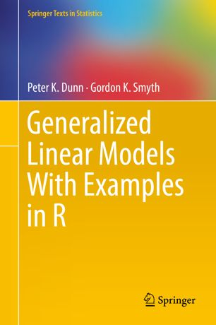

# Gordon K Smyth

Joint Head of the Bioinformatics Division at the Walter and Eliza Hall Institute of Medical Research, Australia.

* [My official WEHI home page](http://www.wehi.edu.au/people/gordon-smyth)
* [My personal research page](http://www.statsci.org/smyth)
* [Google Scholar page](https://scholar.google.com.au/citations?user=k1z6axEAAAAJ&hl=en)
* [ORCID page](https://orcid.org/0000-0001-9221-2892)
* [LinkedIn page](https://au.linkedin.com/in/gordonsmyth)
* [Bioconductor Support page](https://support.bioconductor.org/u/179)

